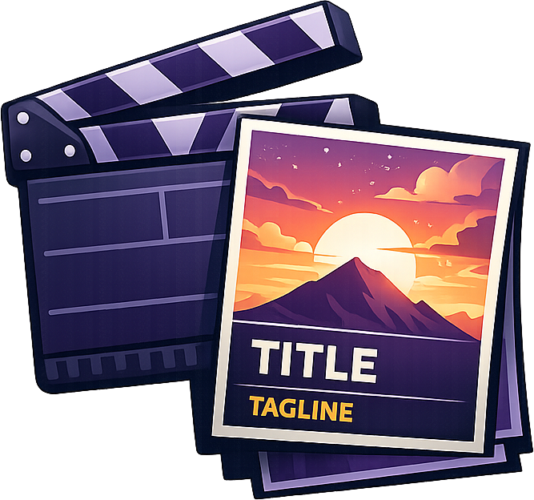

<div align="center">



# Posters Enhanced

[](https://github.com/PlazzmiK/jellyfin-posters-enchanced/releases/latest)
[](https://github.com/PlazzmiK/jellyfin-posters-enchanced/actions/workflows/CI.yml)
[](./LICENSE.md)

**Posters Enhanced** is a Jellyfin plugin that non-destructively enriches movie and show posters with media info badges (4K, Dolby Vision, HDR, audio codecs) and customizable rating pills using high-performance vector and raster compositing powered by **SkiaSharp**.

</div>

**Minimum Jellyfin version:** 10.11.10

---

## Features

- **Non-Destructive Poster Preservation:** Untouched original posters are saved alongside your media files as `poster-original.jpg`, keeping your media collection organized and ensuring that updating overlays never degrades image quality.
- **Selective Media Badges:**
  - **Resolution:** Independently toggle badges for `4K UHD`, `1080p FHD`, `720p HD`, and `SD`.
  - **Video Range / HDR:** Toggle badges for `Dolby Vision (DV)`, `HDR10+`, `HDR10`, `HDR`, and `HLG`.
  - **Audio Codecs:** Optional badges for `Dolby Atmos`, `DTS:X`, `TrueHD`, `DTS-HD MA`, and `FLAC`.
- **Dynamic Rating Pill Badges:**
  - Renders sleek rounded rating pills (e.g. `6.3`) with anti-aliasing and drop shadows.
  - **Score-based Color Tiers:**
    - `< 5.0`: **Red**
    - `5.0 – 5.9`: **Orange**
    - `6.0 – 6.9`: **Yellow** (IMDb classic gold)
    - `7.0 – 7.9`: **Green**
    - `≥ 8.0`: **Blue / Diamond**
  - Fully customizable hex colors for every tier or fixed-color mode.
- **Fine-Tunable 9-Point Grid Placement:**
  - Position media badges and rating badges anywhere: `TopLeft`, `TopCenter`, `TopRight`, `CenterLeft`, `Center`, `CenterRight`, `BottomLeft`, `BottomCenter`, `BottomRight`.
  - Fine-tune horizontal/vertical offsets (px), scale (%), and badge spacing.
- **Theme Pack Support:**
  - Crisp, anti-aliased vector badges generated out-of-the-box with zero configuration.
  - Drop custom PNG badges into `<JellyfinData>/PostersEnhanced/themes/{theme}/badges/` (e.g. `4k.png`, `dv.png`) for instant visual customization.
- **Smart Re-Render Optimization:**
  - Automatically skips items if configuration, media info, and source posters have not changed, making library updates lightning fast.
- **1-Click Restore Task:**
  - Revert all posters back to pristine backups at any time via the **Restore Original Posters** scheduled task.

---

## Configuration & Setup

1. In Jellyfin, open **Dashboard &rarr; Plugins &rarr; My Plugins &rarr; Posters Enhanced**.
2. Customize your preferred badge toggles, anchor placements, and rating color tiers. The live interactive preview updates instantly.
3. Click **Save Configuration**.
4. To apply overlays across your library:
   - Go to **Dashboard &rarr; Scheduled Tasks**.
   - Run **Update Enhanced Posters**.

---

## Build from Source

1. Install the .NET 9 SDK.
2. From the repository root, run:

   ```shell
   dotnet publish PostersEnhanced/PostersEnhanced.csproj -c Release
   ```

3. Copy `PostersEnhanced.dll` into your Jellyfin plugin folder and restart Jellyfin.
